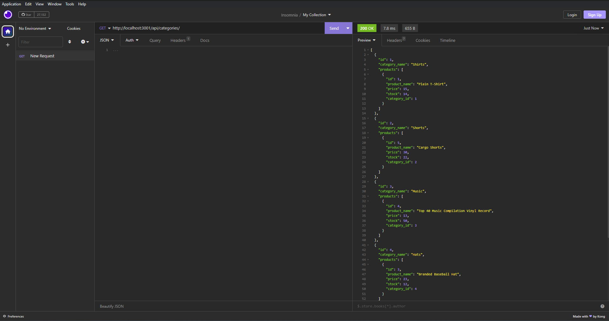

# E-Commerce Back End

## Module-13 Object-Relational Mapping (ORM): 
```md
A back end database for an e-commerce company.
```

## Table of Contents

 * [User-Story](#user-story)
 * [Acceptance-Criteria](#acceptance-criteria)
 * [Installation](#installation)
 * [Application-Demonstration](#application-demonstration)
 * [Video-Demonstration](#video-demonstration)

## User Story

```md
AS A manager at an internet retail company
I WANT a back end for my e-commerce website that uses the latest technologies
SO THAT my company can compete with other e-commerce companies
```

## Acceptance Criteria

```md
GIVEN a functional Express.js API
WHEN I add my database name, MySQL username, and MySQL password to an environment variable file
THEN I am able to connect to a database using Sequelize
WHEN I enter schema and seed commands
THEN a development database is created and is seeded with test data
WHEN I enter the command to invoke the application
THEN my server is started and the Sequelize models are synced to the MySQL database
WHEN I open API GET routes in Insomnia Core for categories, products, or tags
THEN the data for each of these routes is displayed in a formatted JSON
WHEN I test API POST, PUT, and DELETE routes in Insomnia Core
THEN I am able to successfully create, update, and delete data in my database
```
## Installation

```md
Right click on the E-Commerce-Back-End folder and click "Open in integrated terminal" 
type "npm i" to install dependencies
type "cd .." to return to the previous directory
type "cd db" to enter the db folder
type "mysql -u root -p" then enter your password
type "source schema.sql"
Then type "exit" to terminate mysql
type "cd .." to return to the previous directory
type "cd seeds" to enter the seeds folder
type "node index.js" to seed the database
type "cd .." to return to the previous directory
type "npm start" to start the database
```

## Application Demonstration




## Video Demonstration

https://drive.google.com/file/d/11h0n9wh7E9LNp2r3kSEZOiQUJ5N2C2af/view?usp=share_link